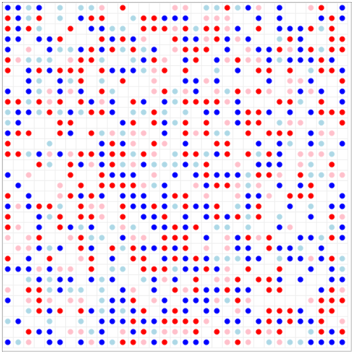
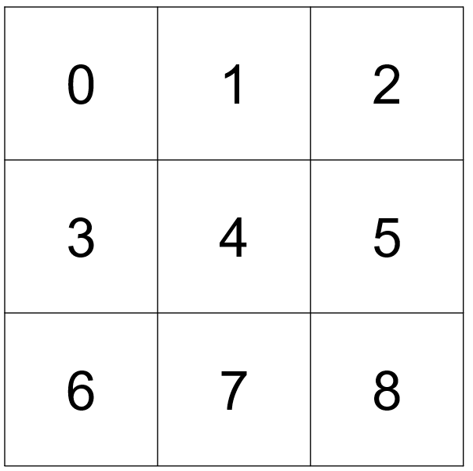

# Do Voting Systems Affect Segregation
## Schelling segregation model under different voting systems
### By: Julia Baumann, Tadas Gedminas and Axel Purwin

This repository contains code that is necessary for replicating "Do Voting Systems Affect Segregation" project. The modelling part of the project was done using Python, in particular implemented with Mesa agent based modelling module. Data analysis on simulation results was performed with R. The paper was written using LaTeX.

In order to replicate and run the project the following program requirements are necessary:

 * Python version that is 3.+
 * Python modules: `pandas`, `numpy`, `random`, `time`, `mesa`
 * R 3.4.2+ with packages `xtable` and `tidyverse` installed
 * LaTeX library manager to install necessary packages for generating the PDF.
 
The project has the following file structure. For each different election system there is an individual folder called `X_elections`, where `X` is one of `AUS`, `UK` or `US`. In each election folder there are 3 files:

1) `model_X.py` - python code that defines the setup of the model for each election case;
2) `server_X.py` - python code used for running the simulation iteractively (explained below);
3) `run.py` - python code used for running the sumulation iteractively (explained below);

`data_collect.py` is python code used for generating simulationd data used for analysis. The code runs election simulation for as specified number of times, each time for a specified number of steps. Note, given the inhrenet randomness associated with running the simulation, each different setup or analysis consideration defines a 'seed', which allows to precisely replicate results presented in our analysis. The output of `data_collect.py` files are `.csv` files, which are stored in the `Data` folder, to be used in analysis with R. The naming convention of these files is as follows: `out_X.csv`, where `X` is as before, stores results of our 'baseline' simulation; `out_X_th.csv`, where `X` is as before and `th` reflects that the output re-runs the original simulation by changing utility threshold; `out_X_el.csv`, where `X` is as before and `el` reflects that the output re-runs the original simulation by changing utility gains from winning elections; `out_X_nb.csv`, where `X` is as before and `nb` reflects that the output re-runs the original simulation by changing neighborhood utility gains; and `out_X_1000.csv`, where `X` is as before, but the baseline simulation is extended to 1000 steps, to include long-run dynamics.

`adj_output.R` is R code used for analysing simulation data. IMPORTANT NOTE: before running R code make sure to set working directory to the folder which contains the project and that the two libraries, `xtable` and `tidyverse`, are installed. The R code first cleans the data and calculates relevant measures described in our paper. The output of the R code is contained in `Plots` and `Tables` folders. The naming convention is the same as in the data file with few differences. Files that begin with `agg` vs. `grp` indicate whether calculated ratios are aggregated over all groups or are group specific (refer to paper for the differences). In the `Plots` folder in addition to indicator measures additional plots are included. `box_plot` shows the variation behind simulation results, as it reports the result distribution after 100 steps, as oppose to reporting the mean values at certain steps. `election_plot` calculates the fraction of locations in our simulation that have changing election winners. The plot is only done for the baseline case.

The project also contains tools for running the simulations interactively. This can be done by setting your working environment to the folder that contains the project and after running command `python X_elections/run.py` in Git Bash, Command Line or similar tool,, where `X` is as before. This will create a local server which allows to observe and manipulate the simulation in a browser. It is also possible to change simulation parameters, whereas the default values match the 'baseline' specification. 

Some further comments regarding the setup of the simulation. The overall grid size of the area in which agents move is defined to be 33x33. Furthermore, this grid is dvided into 9 locations, each sized 11x11. When using the interactive version of the project or when going over the model it may not be clear immediately to which location we are refering to, as the borders are not explicitly plotted (See picture below on the left). In the code we index and refer to these locations by row numbering, starting from zero (See picture below on the right).

| | |
|:-------------------------:|:-------------------------:|
|  |  |
